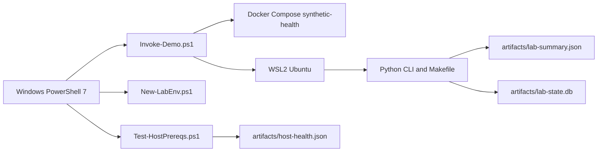

# win-netlab-foundation

[](https://github.com/RedBeret/win-netlab-foundation/actions/workflows/ci.yml)
[](LICENSE)
[](#platform-contract)

> Windows-first, local-only, synthetic training repo for network automation study.  
> Maintained in an operator-first style by [@RedBeret](https://github.com/RedBeret).

`win-netlab-foundation` is the foundation repo in an incremental project series. It helps you get to a clean, repeatable Windows development shell before you move on to harder labs. It does not install host software for you. It checks what is present, explains what is missing, and gives you a safe demo path built entirely from synthetic data.

## Why This Repo Exists

Most automation labs go sideways before the first line of useful code. The problem is usually platform drift, not automation logic.

This repo fixes that first.

- Windows is the user-facing control plane.
- WSL2 Ubuntu is the Linux runtime for Linux-only tooling.
- Docker Compose is used only for a local synthetic demo.
- All inventory, IPs, usernames, and serials stay fake by design.

## What This Teaches

- PowerShell 7 orchestration from a Windows host
- WSL2 basics and host to runtime boundaries
- Docker Desktop with a WSL-backed workflow
- Explicit validation and machine-readable health reporting
- Structured logging, retries with backoff, timeouts, and health checks
- Idempotent local setup that is safe to rerun
- Repo hygiene for later labs in the series

## What This Is Not

- Not a production bootstrapper
- Not a silent installer for PowerShell, Git, WSL, Docker Desktop, or Python
- Not a real device lab
- Not a place for customer data, proprietary images, or live credentials
- Not a shortcut around learning the host and runtime boundary

## Platform Contract

| Area | Runs Where | Responsibility |
| --- | --- | --- |
| PowerShell scripts | Windows host | Main entrypoint, prerequisite checks, local scaffolding, reports |
| Python, `make`, pytest | WSL2 Ubuntu | Linux-side tooling and local helper workflows |
| Synthetic health service | Docker Compose | Fast local demo with health checks only |

If a tool expects Bash, Linux paths, or Linux package behavior, it belongs in WSL2 Ubuntu or a container, not directly on the Windows host.



## Quick Start

From Windows PowerShell 7 in the repo root:

```powershell
pwsh -File .\scripts\Test-HostPrereqs.ps1
pwsh -File .\scripts\New-LabEnv.ps1
pwsh -File .\scripts\Invoke-Demo.ps1
```

On a healthy workstation, the demo finishes in under five minutes and writes:

- [`artifacts/host-health.json`](artifacts/host-health.json)
- [`artifacts/lab-summary.json`](artifacts/lab-summary.json)
- `artifacts/lab-state.db`

If the host is not ready yet, the prerequisite script still gives you a clean pass or fail report and writes a machine-readable health file you can troubleshoot from.

## Publishing Notes

This repo is prepared for GitHub with:

- GitHub Actions CI for PowerShell and Python tests
- issue templates for bugs and improvements
- a pull request template with safety checks
- CODEOWNERS for maintainer review
- an MIT license and a contributing guide

## What You Get

- [`scripts/Test-HostPrereqs.ps1`](scripts/Test-HostPrereqs.ps1)
  Prints a pass or fail prerequisite report and writes `artifacts/host-health.json`.
- [`scripts/Test-WslState.ps1`](scripts/Test-WslState.ps1)
  Checks WSL presence, Ubuntu availability, and Python inside WSL.
- [`scripts/Test-DockerState.ps1`](scripts/Test-DockerState.ps1)
  Checks Docker Desktop state and `docker compose` availability.
- [`scripts/New-LabEnv.ps1`](scripts/New-LabEnv.ps1)
  Creates `.env.local` and `configs/lab.config.json` from templates without overwriting local edits.
- [`scripts/Invoke-Demo.ps1`](scripts/Invoke-Demo.ps1)
  Runs the end-to-end Windows-first demo.
- [`Makefile`](Makefile)
  Provides WSL-side `validate`, `demo`, `test`, `install`, and `clean` targets.
- [`compose.yaml`](compose.yaml)
  Starts a synthetic local health service only.

## Synthetic Data Rules

This repo stays safe because it is strict about fake data:

- Hostnames use names like `edge-a.lab.example`
- Management IPs stay inside RFC5737 ranges like `192.0.2.10`
- Usernames stay synthetic, like `lab-operator`
- Serials stay fake, like `FTX0000LAB01`
- No real credentials are stored or generated

## Repo Layout

```text
.
|-- scripts/
|-- src/win_netlab_foundation/
|-- docs/
|-- tests/
|-- inventory/
|-- playbooks/
|-- topologies/
|-- labs/future-01/
|-- compose.yaml
|-- Makefile
`-- README.md
```

## WSL Commands

Inside WSL2 Ubuntu:

```bash
make validate
make demo
make test
```

## Rollback Notes

- `pwsh -File .\scripts\New-LabEnv.ps1`
  Delete `.env.local` and `configs/lab.config.json`.
- `pwsh -File .\scripts\Invoke-Demo.ps1`
  Delete `artifacts/lab-state.db`, `artifacts/lab-summary.json`, and `artifacts/host-health.json`. If you used `-KeepServiceUp`, run `docker compose down --remove-orphans`.
- `make install`
  Remove `.venv` or uninstall the editable package from your WSL Python environment.

## Documentation

- [Engineering Notes](docs/engineering-notes.md)
- [Study Guide](docs/study-guide.md)
- [Runbook](docs/runbook.md)
- [Failure Modes](docs/failure-modes.md)
- [Review Questions](docs/review-questions.md)
- [ADR 001](docs/adr/001-windows-host-wsl-runtime.md)
- [ADR 002](docs/adr/002-powershell-entrypoint-and-idempotent-scaffolding.md)
- [ADR 003](docs/adr/003-local-only-synthetic-demo.md)

## Contributing

See [CONTRIBUTING.md](CONTRIBUTING.md).

## License

This project is released under the [MIT License](LICENSE).
# win-netlab-foundation
