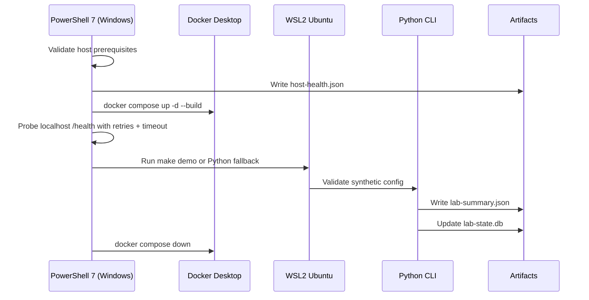

# Engineering Notes

## Why Windows Host + WSL Runtime

The repo is intentionally split:

- Windows is the human-facing control plane.
- WSL2 Ubuntu is the Linux runtime for tooling that expects Bash, `make`, Linux paths, or Linux package semantics.
- Docker Desktop is optional but valuable for fast local health checks that feel like a real service boundary without using real network devices.

This keeps the learning surface stable. You debug the host once, then reuse the same contract in later labs.

## Design Goals

- Windows-first entrypoint from PowerShell 7.
- No silent installation of host prerequisites.
- Local-only synthetic data and services.
- Idempotent reruns.
- Machine-readable health reporting.
- Clear rollback notes for every mutating action.

## Runtime Flow

## Why the Demo Uses SQLite

SQLite gives later labs a predictable local persistence layer without adding a networked database or extra infrastructure. It is fast, inspectable, and easy to reset.

## Why the Demo Uses Docker Compose

Compose is useful here because it gives you:

- A realistic service lifecycle.
- A health check that PowerShell can wait on.
- A safe place to practice start/stop/inspect workflows with synthetic payloads.

## Why the Python Helper Has a Zero-Dependency Path

The repo prefers Python 3.12, Pydantic, Typer, and pytest, but the initial demo path also needs to stay runnable on a freshly prepared workstation. The CLI therefore falls back to the standard library if optional Python packages are not installed yet.

## Operational Guardrails

- Structured logs go to `artifacts/logs/*.jsonl`.
- All validation is explicit and fail-fast.
- Health probes use retries with exponential backoff and timeouts.
- Scaffolding never overwrites `.env.local` or `configs/lab.config.json`.

## Boundaries to Preserve in Later Labs

- Keep Windows as the main human entrypoint.
- Keep Linux-only tooling inside WSL or containers.
- Keep the data set synthetic until there is a deliberate reason to add more realism.
- Keep rollback steps documented alongside every mutating workflow.

